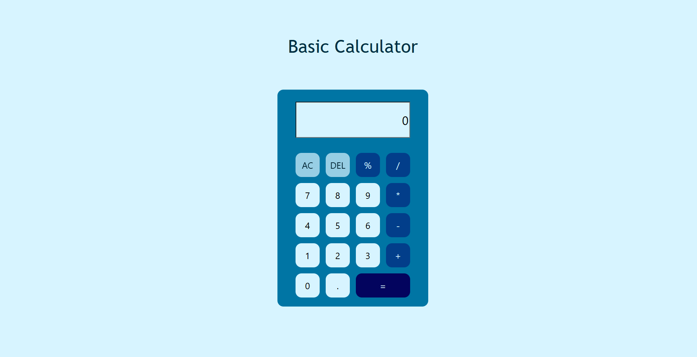

# CALCULATOR

   

## Description

 
This is a basic alculator that will allow user to perform simple operations like : addition, subtraction, multiplication, division and finding out percentage of a number.
   

## Features

 
--> Sleek, simple design resembling an actual calculator.
 
--> Hover button effects giving a visually appealing look.
 
--> Allow continuous operations i.e allows user to perform further operations on the obtained result (if needed).
 
   

## Technologies Used

 
--> React JS : Componentizing, event handling, state management(useState()), passing data via props.
   

## Credits

 
--> Coolors for generating customized palette.
  
--> MDN docs and Youtube for added assistance.

## License

 
This project belongs solely to the author

## Screenshots

   

