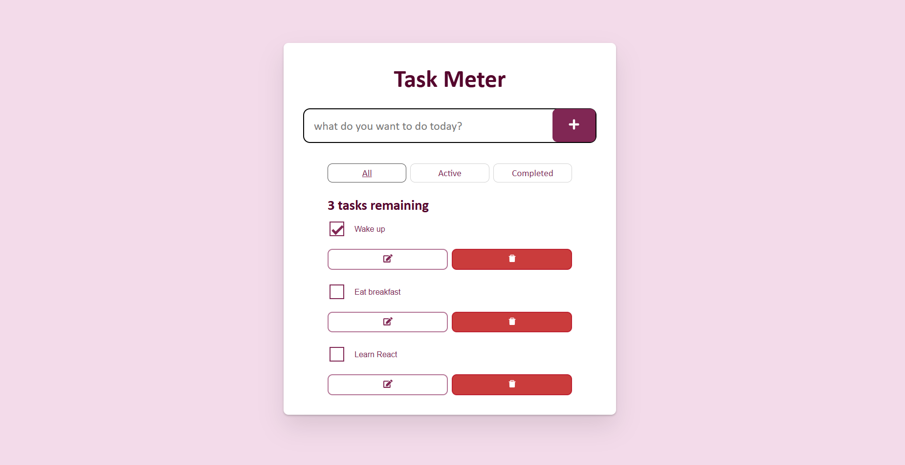

# TASK METER : TO-DO WEB APPLICATION

   

## Description

 
This is a basic to-do web application that will allow user to add, delete, update and mark their tasks.
   

## Features

 
--> View your completed and active tasks including the functionality of editing them. The tasks will be available even if marked completed and can be edited at all times unless deleted permanently.
 
--> Fully responsive.
 
--> Alert message if clicked add without typing any task.
   

## Technologies Used

 
--> React JS : Componentizing, event handling, state management(useState()), passing data via props.
   

## Credits

 
--> React icons used for UI.
 
--> Coolors for generating customized palette.
  
--> MDN docs and Youtube for added assistance.

## License

 
This project belongs solely to the author

## Screenshots

   
